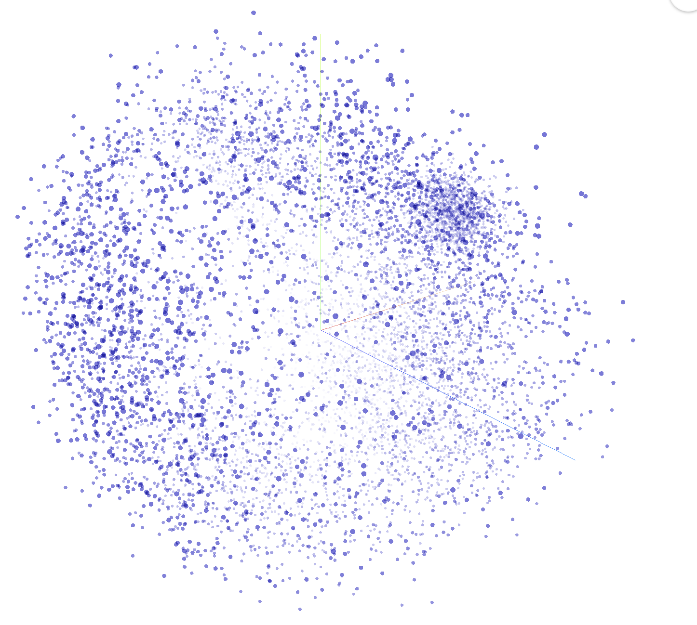
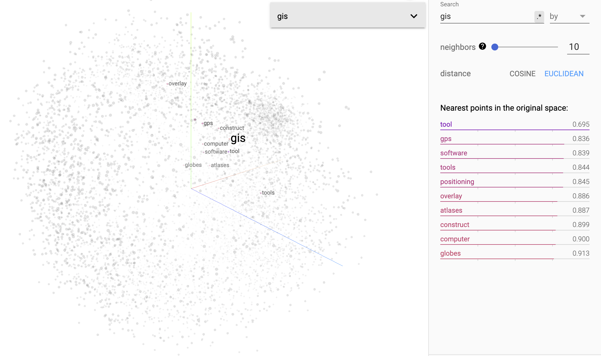
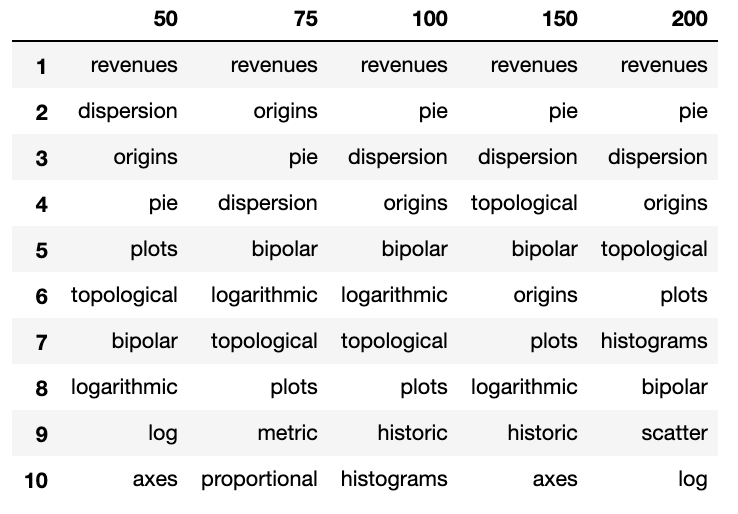
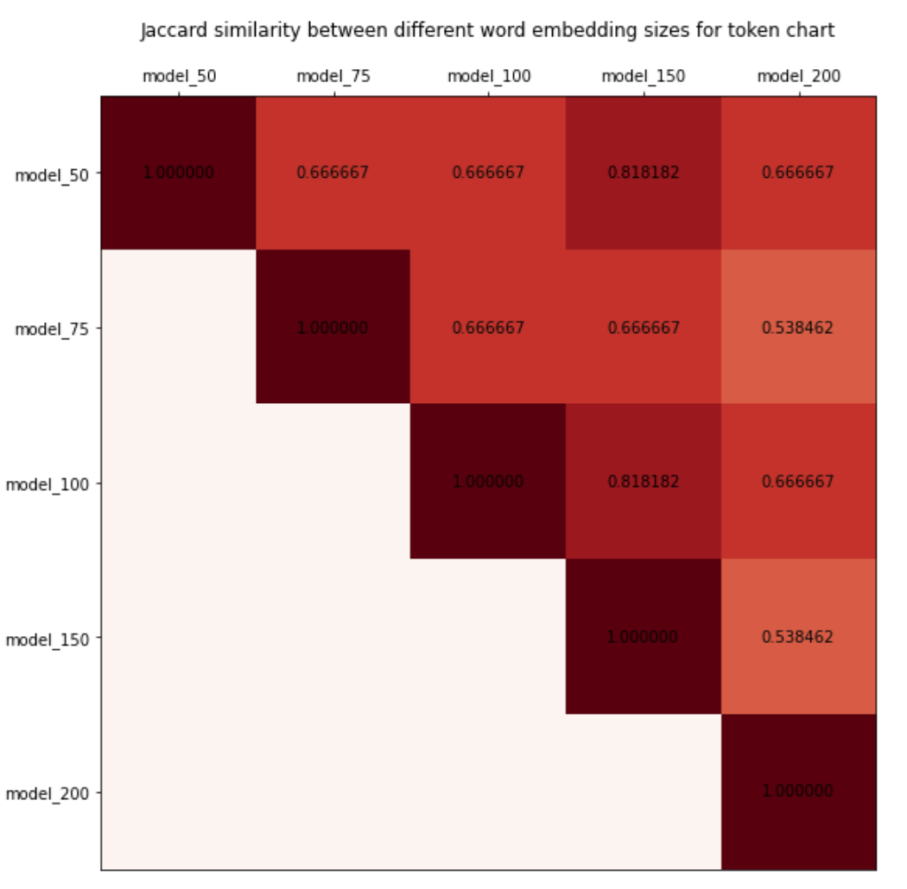
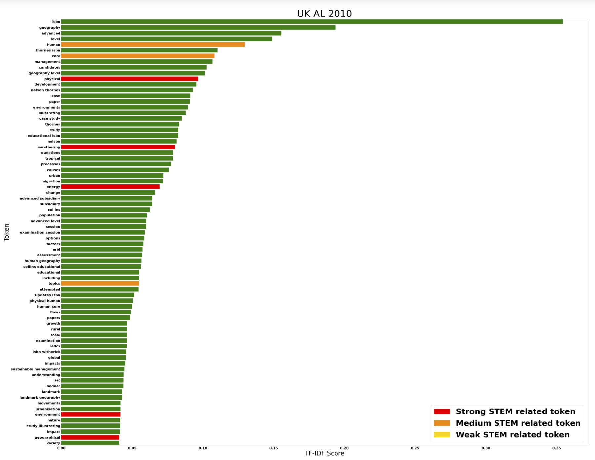
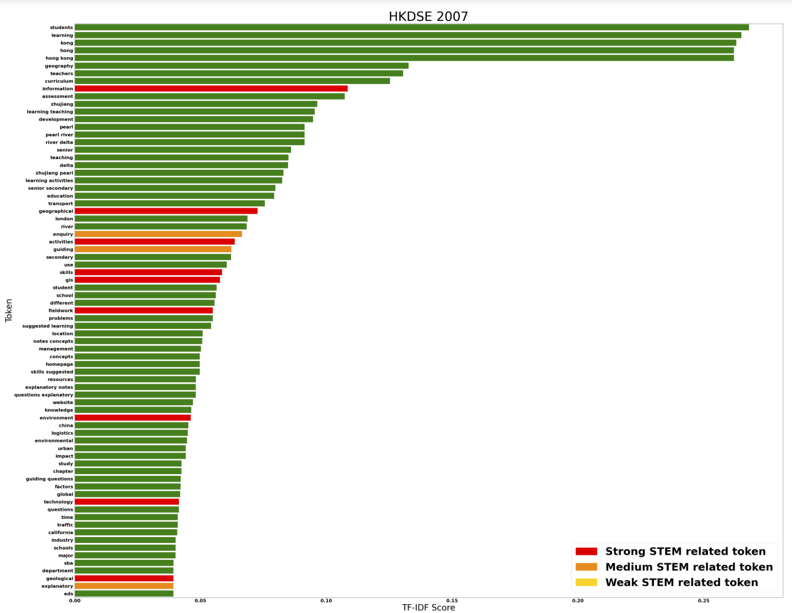
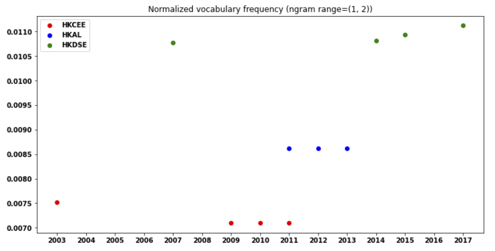

# nlp-geography

*An exploratory data analysis on geography syllabi from different curriculum across various countries.*

### 1. About
We are trying to analyse different geography syllabus from multiple resources (A Level, HKDSE, IB, etc) to find whether there is an increasing trend in terms of relation between geography and STEM education.
For each syllabus of a particular country (i.e. HKDSE for Hong Kong, Cambridge A Level for UK, etc), we performed EDA based on one temporal dimension which is the year in which each syllabus was released and used by schools. 
The focus here is on Secondary High School syllabi, but further analysis can be made to extend the current results.

### 2. Methodology
#### 2a. Word embeddings model
We used multiple statistical analysis and NLP techniques on this task. We began by manually listing out potential STEM related tokens which might be present on a geography syllabus. 
This was done by performing some simple automated google search queries from a python script, and collecting the most likely to occur tokens via html scrapping.
The initial token includes word/phrase like engineering, geoscience, gps, etc, and consists of approximately 100 tokens.
The full list of tokens can be seen in [vocabulary.txt](./vocabulary.txt).

In order to minimise bias and expand our vocabulary, we developed a word-embedding model based on the [word2vec](https://arxiv.org/pdf/1301.3781.pdf) embedding implementation (Mikolov et al., 2013).
We decided to use the skipgram word2vec implementation and negative sampling technique to avoid expensive computations when calculating the softmax functions. 
The word2vec embedding model was trained on different geography related literatures including our initial syllabus data and multiple academic journals revolving around the topic of Geography and STEM education.
Here is the result of our embedding model projected on 3 Principal Components, while the original vector space is of size 100.

We then performed a 10-Nearest Neighbours search for each token in our initial STEM tokens list based on the data points on the word2vec embedding space, and included those nearest neighbours to our STEM token vocabulary. 
This was done to expand our STEM vocabulary so that further statistical analysis can be done based on a more rich vocabulary which is less biased and is a result of a word2vec embedding trained on wider dataset outside of our syllabi.
To illustrate the idea, here is the 10-Nearest Token in the embedding space for the token *gis*. Intuitively, you can think of this as the top 10 tokens which are most likely to co-occur with *gis* and have high semantic and/or syntatic similarity with it.

Additionally, to measure the robustness of our word embedding model, we tried training our model using different hyperparameters by changing the embedding vector size (i.e. 50, 75, 100, 150, 200) and observing whether there was a huge difference in terms of result.
By having different nearest neighbours search results, we compared whether the differences between each pair of embedding results are significant by computing the [Jaccard Index](https://en.wikipedia.org/wiki/Jaccard_index) of the corresponding nearest neighbours sets.
For example, using an embedding vector size of 50, 75, 100, 150, and 200, we obtained the following 10-Nearest neighbours results for the token *chart*,

The full observation on another token can be obtained by tweaking our [word embeddings notebook](word_embeddings.ipynb).

#### 2b. Data pre-processing
We used a simple [Regex](https://en.wikipedia.org/wiki/Regular_expression) based data pre-processing pipeline to clean up our text data. This includes removing stopwords, numbers, and whatnot. The complete implementation can be seen in the [TextPreprocessor module](./modules/text_preprocessor.py).
One step further from that, we also eliminated gibberish non english words which were present due to inaccuracies in the OCR process that we used when scanning each pdf documents and converting them into text representation.

#### 2c. Analysis
There are a couple of exploratory data analysis techniques that we used to come up with the result on this task. It includes some well-known NLP implementations such as bag-of-words model, tf-idf, and RAKE. 
These are used to find, for a particular syllabus, whether there is a significant amount of STEM-related components in it. The numbers we obtained from each methods are then compared with syllabi from different countries and years.
For example here are the top 100 tokens (sorted by descending tf-idf score) for the 2010 UK A Level syllabus and 2007 HKDSE syllabus. Graphically, they have pretty much the same proportion and structure. What we are trying to do is observing different plots and measurements (just like what you see down below) to see if there is any patterns/trends.

In addition to that, we also performed a temporal analysis to capture trends for each region/country in terms of STEM related components in its syllabus. Here is an example for Hong Kong where we tried to see the normalized STEM related token counts in its syllabi throughout different years and curriculums.

If you are interested to observe more about the results, feel free to visit some of the notebooks in this repository, we provided a brief description on each code chunk to denote what each block of code does and is about.

### 3. Contact
Due to copyright and storage issues, we decided not to push the data we collected and results we obtained here. This includes things such as our word embeddings vectors result, syllabi data, etc. If you would like to know more, please reach out to [welvin07@gmail.com](mailto:welvin07@gmail.com).

